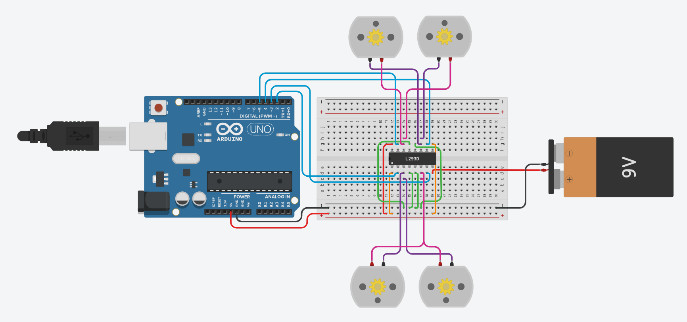

# Arduino DC Motor Control Simulation

This project demonstrates the control of four DC motors using an Arduino Uno and an L293D motor driver in Tinkercad. The motors work together to simulate basic robot movements, with the circuit assembled on a virtual breadboard and programmed in C++ to control their direction and timing.

The program controls the four motors through a sequence of movements, moving the simulated robot forward for 30 seconds, backward for 60 seconds, and then alternating between right and left turns for 60 seconds. The project demonstrates basic DC motor control, motor direction switching using an H-bridge motor driver, and the use of Arduino digital output pins.

## Components

- Arduino Uno
- 4 × DC Motors
- L293D H-Bridge Motor Driver
- 9V Battery
- Breadboard
- Jumper Wires

## Features

- Controls four DC motors using an L293D motor driver.
- Moves forward for 30 seconds.
- Moves backward for 60 seconds.
- Alternates between right and left turns for 60 seconds.
- Controls motor direction using Arduino digital outputs.
- Implemented in C++ using Arduino.
- Designed and simulated entirely in Tinkercad.

## Project Files

- `arduino_dc_motor_simulation.ino` — Arduino source code.
- `Picture.png` — Circuit layout.

## Simulation

The interactive project simulation can be viewed and tested in Tinkercad:

[Tinkercad Simulation](https://www.tinkercad.com/things/9CM2UrddjTI-arduino-dc-motor-control-simulation?sharecode=Ik22A1wByn8PIdO3aPBvZqKbX3Ff92Ayf_PkeQ4NE6g)
